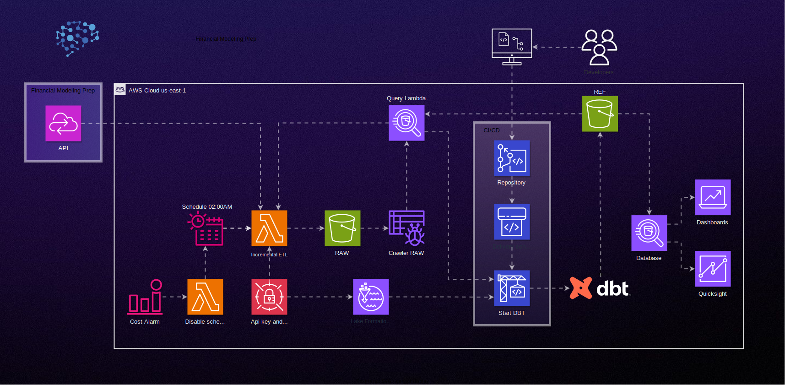

# Documentation for Financial Modeling Prep ETL Architecture - Freelance Project

## Overview

This document outlines the architecture of a freelance ETL project using AWS SAM CLI. The focus is on integrating with the Financial Modeling Prep API to process financial data. The architecture performs the following daily steps:

1. **Extraction of Financial Modeling Prep API Data**: At 2 AM, a Lambda function is triggered to retrieve data from three endpoints of the API.

2. **Data Transformation**: Before Lambda execution, the "raw" bucket is cleared, leaving only the "ref" bucket. New data is placed in the "raw" bucket. Then, Lambda triggers CodeBuild.

3. **Load into Data Warehouse with dbt**: CodeBuild clones the CodeCommit repository and runs dbt to process new API data from the "raw" bucket to the "ref" bucket.

4. **Cost Management**: A CloudWatch alarm monitors monthly AWS costs. If it exceeds $10, a Lambda is triggered to disable the Lambda ETL schedule.

## Parameters

- **Tags**: Identification of resources (project, environment, raw, ref, athena, etc.).

- **S3 Bucket**: Name of the S3 bucket to store raw data.

- **Database and Table**: Name of the Glue database and associated table.

- **Roles**: Names for IAM roles (Lambda, Crawler, CodeBuild, etc.).

- **Schedule**: Lambda scheduling configuration.

- **Credentials**: Group, user, and API key for access to the Financial Modeling Prep API and Athena.

- **Build dbt**: CodeCommit repository and CodeBuild project name.

## Conditions

- Condition to enable or disable Lambda scheduling based on the "EnableSchedule" parameter.

## Resources

### Credentials

- **IAM Group and User**: Creation of an IAM group and user for API and Athena access.

- **IAM Access Key**: Generation of an access key for the IAM user.

### Core Resources

- **CodeCommit Repository**: Creation of a repository to store the code.

- **S3 Buckets**: Creation of S3 buckets for raw, reference, and Athena data.

- **Lambda Layer for HTTP Requests**: Creation of a Lambda layer to support HTTP requests.

- **ETL Lambda Function**: Creation of a Lambda function to execute ETL daily.

- **CodeBuild Project**: Creation of a CodeBuild project for building and running dbt.

- **Data Lake Configuration**: Configuration of permissions for the Data Lake.

- **Cost Alarm**: Creation of a CloudWatch alarm to monitor costs.

- **Lambda to Disable Schedule**: Creation of a Lambda to disable the ETL Lambda schedule in case of high costs.

### Roles and Policies

- Various IAM roles and policies to grant necessary permissions to services like Lambda, CodeBuild, Athena, and Glue.

## Final Remarks

This document describes the architecture of a freelance ETL project that integrates financial data from the Financial Modeling Prep API. Be sure to adjust parameters as needed and review permissions assigned to IAM roles for proper security.
